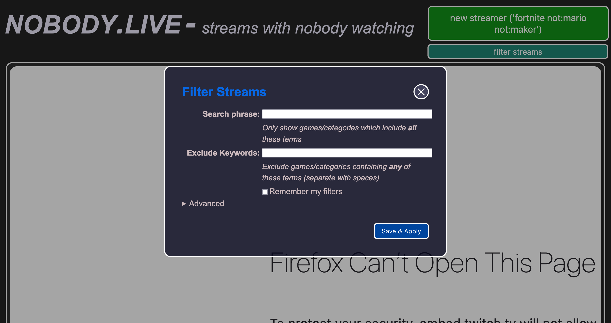

# nobody.live (rethemed)

## What is this fork? 

This fork is intended to be a place where I (Fluffykitty) am experementing with a different theme for the nobody.live website and other sites using the same web based front end. 

## Screenshots




## TO-DO/Plans

- [ ] Add a Light Theme
- [ ] Add Custom Text Boxes
- [ ] Check for Accessibility
- [ ] Adjust Contrast More
- [ ] Choose a Primary and Secondary Color
- [ ] Incooperate CSS Variables
- [ ]  Add in Vendor Prefixes

## Maybe's

- [ ] Rewrite all the CSS in SCSS
- [ ] Write mix-ins for the most common styles 
  - [ ] Border radius mix-in
  - [ ] Darken mix-in
  - [ ] Lighten mix-in

## Questions Answered

Q: Why is this fork using a mirrored copy of the currently live site? 

A: Well I am a front end web developer and because of that I have a hard time understanding how to setup a database and all of that, so instead I mirrored the current site and mirgrated the changed from the current (Maybe unreleased) version on Github over, making a few manual changes (Such as always showing the MOTD) that _in the server_ would not be needed, also I am just too lazy and I would rather use PHP server. 

Q: How do I setup this for a quick preview?

A: On Linux and MacOS just change your terminal into the directory and then run your faviourite testing server, mine is php server, I run ```php -S 0.0.0.0:8080``` for mine and then i navigate to ```localhost:8080``` in my browser. 

----

## Architecture

A worker script (`scanner.py`) loops through the Twitch API's list of streams and spins until it inserts all streamers it finds matching the search criteria (default zero viewers), then it starts again. These streamers are pruned after a set number of seconds (`SECONDS_BEFORE_RECORD_EXPIRATION`) on the assumption that someone will view them and then they won't have zero viewers any more so should not be served for too long.

Environment variables needed for both scanner and app:

* `NOBODY_HOST`: the database host
* `NOBODY_DATABASE`: the database name
* `NOBODY_USER`: the database user
* `NOBODY_PASSWORD`: the database password

Environment variables to be set for the scanner only:

* `CLIENT_ID`: Your Twitch application client ID (found at https://dev.twitch.tv/console)
* `CLIENT_SECRET`: Your Twitch application client secret (found at https://dev.twitch.tv/console)

Meanwhile, the Flask app in `app.py` serves the index and the endpoint to get a random streamer.

## Getting Up and Running

* Install and start Postgres with a created database
* Run the stream fetcher (e.g. `CLIENT_ID=xxxxxx CLIENT_SECRET=xxxxxx scanner.py`). This will need to run continuously. Be sure to include your database credentials.
* Run the flask app (`flask run`). Be sure to include your database credentials.

This is obviously not production ready; you'll need to make sure all services are running as daemons (some config files are included in `etc`) and that your flask app is running safely (e.g. behind gunicorn/nginx/pick your poison).

## Dependencies

Update direct dependencies in `requirements.in`; use `pip-compile` to compile them down to `requirements.txt` if you update them.
