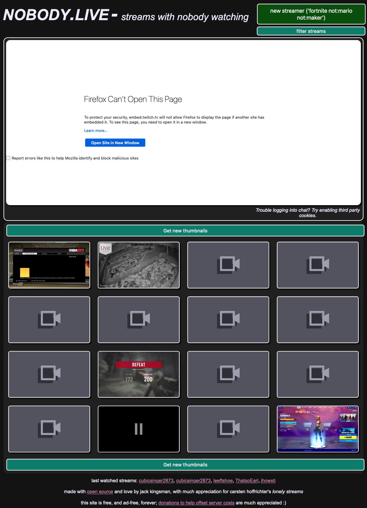

# nobody.live (rethemed)

## What is this fork? 

This fork is intended to be a place where I (Fluffykitty) am experementing with a different theme for the nobody.live website and other sites using the same web based front end. 

## Screenshots




## TO-DO/Plans

- [ ] Add a Light Theme
- [ ] Add Custom Text Boxes
- [ ] Check for Accessibility
- [ ] Adjust Contrast More
- [ ] Choose a Primary and Secondary Color
- [ ] Incooperate CSS Variables
- [ ]  Add in Vendor Prefixes

## Maybe's

- [ ] Rewrite all the CSS in SCSS
- [ ] Write mix-ins for the most common styles 
  - [ ] Border radius mix-in
  - [ ] Darken mix-in
  - [ ] Lighten mix-in

## Questions Answered

Q: Why is this fork using a mirrored copy of the currently live site? 

A: Well I am a front end web developer and because of that I have a hard time understanding how to setup a database and all of that, so instead I mirrored the current site and mirgrated the changed from the current (Maybe unreleased) version on Github over, making a few manual changes (Such as always showing the MOTD) that _in the server_ would not be needed, also I am just too lazy and I would rather use PHP server. 

Q: How do I setup this for a quick preview?

A: On Linux and MacOS just change your terminal into the directory and then run your faviourite testing server, mine is php server, I run ```php -S 0.0.0.0:8080``` for mine and then i navigate to ```localhost:8080``` in my browser. 

